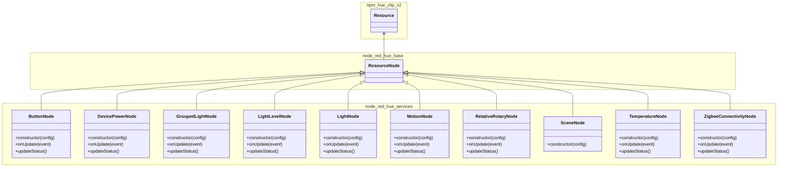

# node-red-hue-services
node-red palette to access hue bridge through clip v2 api

# Status

(Last update: 2026/jan/06)
This is not complete, but seems to work consistent and reliable for the services I regularly use.
(motion/temperature/light_level/light/grouped_light/button/relative_rotary/scene/contact/camera_motion).

Unit tests are in place for the server side nodes.

Editor/UI functionality is currently not being tested apart from my own use in the editor, so your mileage may vary. If something seems to be broken, then please submit an issue.

## Dependencies
 - debug: ^4.4.3
 - [@hurenkam/node-red-hue-base](https://github.com/hurenkam/node-red-hue-base): ^0.7.0

## Changelog
#### v0.7.0: Split the package into functionally separate parts:
 - [@hurenkam/npm-utils](https://github.com/hurenkam/npm-utils): New utility package which contains finite state machine base classes.
 - [@hurenkam/npm-hue-clip-v2](https://github.com/hurenkam/npm-hue-clip-v2): Contains the classes that deal with interfacing with the bridge using clip v2, and can be used outside of node-red as well.
 - [@hurenkam/node-red-hue-base](https://github.com/hurenkam/node-red-hue-base): Contains the `BridgeConfig` node and the `Service` node, these are the basic node-red nodes that enable interacting with any clip v2 service (depends on [@hurenkam/npm-hue-clip-v2](https://github.com/hurenkam/npm-hue-clip-v2))
 - [@hurenkam/node-red-hue-services](https://github.com/hurenkam/node-red-hue-services): This is mostly an eye-candy package, and contains specialized nodes for many known service types, with separate colors and type specific status feedback (depends on [@hurenkam/node-red-hue-base](https://github.com/hurenkam/node-red-hue-base)).
 - [@hurenkam/node-red-hue-behavior](https://github.com/hurenkam/node-red-hue-behavior): This is a new package with nodes that can do more complex automation using messages from/to services as defined in node-red-hue-services. Note that it does not depend on this package specifically, as the dependency is on the message level only (thus could be triggered/used by logic outside this package as well). It does depend on [@hurenkam/npm-utils](https://github.com/hurenkam/npm-utils).

    ##### Warning! The 0.7.0 release breaks existing 0.6.x and 0.5.x flows because the type names have been modified to use the @hurenkam/node-red-hue-services/ prefix.

## Devices / Behaviors:
- Removed for now, services should cover all the basics, devices & behaviors will be re-introduced in a later release as separate packages.

## Services:
- Button
- Camera Motion
- Contact
- Device Power
- Grouped Light
- Light
- Light Level
- Motion
- Relative Rotary
- Scene
- Temperature
- Zigbee Connectivity

## Todo
- Entertainment
- Geofencing
- Unit Tests for UI

# Use
Using these nodes requires a bit of knowledge on the clip v2 api, as i designed this palette to offer an easy low level interface towards clip.

The basic principle of the nodes is that you select the proper id on the bridge, then clip events associated with that resource id will come out as `msg.payload`, and whatever `msg.payload` is piped in at the input will be sent as a put request to the clip v2 interface.
(See here: https://developers.meethue.com/develop/hue-api-v2 )

The following command will for instance switch a light, room or zone on:

`{ "rtypes": ["light", "grouped_light"], "payload": { "on": { "on": true } } }`

And the following command wil set the brightness to 50%:

`{ "rtypes": ["light", "grouped_light"], "payload": { "dimming": { "brightness": 50 } } }`

Do note that to address a node, you must either provide an msg.rids array that contains the rid of the resource you wish to address, or an msg.rtypes array that contains the rtype of the resource you wish to address.

# Design

## Class Diagram

# Debug
(see src/debug.js)
The server side classes are instrumented with logging using the debug module, this can be changed
runtime by sending appropriate GET / POST / DELETE requests to the node-red /debug endpoint
(default: http://localhost:1880/debug):

Use the following command to retrieve the current settings:

`curl -i -H "Accept: application/json" 'localhost:1880/debug'`

Use the following command to enable error and warning logging:

`curl -i -H "Accept: application/json" 'localhost:1880/debug' -d "namespaces='error:*,warn:*"`

Use the following command to disable debug logging:

`curl -i -H "Accept: application/json" 'localhost:1880/debug' -X "DELETE"`

Classes have 4 loglevels:
- error
- warn
- info
- debug

Log messages are typically built like this: `<loglevel>:<class>:<name or id> <logmessage>`, where
currently the following classes exist (see the code). Each level of each class can be enabled
or disabled seperately, and even per instance.

If running locally, you can set the DEBUG environment variable to enable debuggin:
`DEBUG="error:*,warn:*,info:*,trace:*" node-red`
