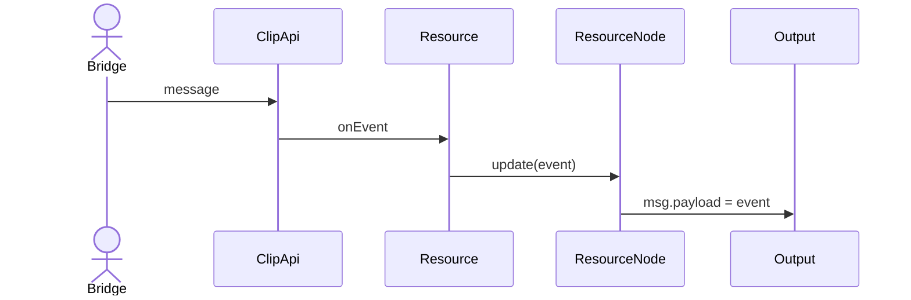
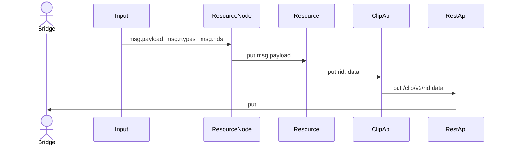
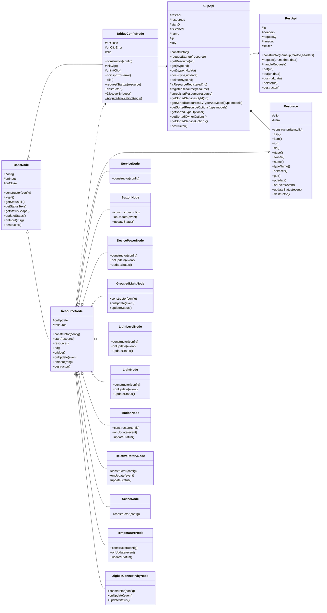

# node-red-hue-services
node-red palette to access hue bridge through clip v2 api

# Status
(tag v0.5, 29/11/2022)

This is by far not complete, but most of the devices and functionality that i regularly use
in my home automation environment seems to work and stability is ok.

## Devices / Behaviors:
- Removed for now, services should cover all the basics, devices & behaviors will be re-introduced in a later release

## Services:
- Generic Service, in case you need some service that is not supported below, you can use this.
- Button
- Device Power
- Grouped Light
- Light
- Light Level
- Motion
- Relative Rotary
- Scene
- Temperature
- Zigbee Connectivity

## Todo
- ~~Bridge discovery and automatic key generation has not yet been implemented. Currently the~~
  ~~bridge needs to be configured manually with an ip address and known key.~~
- ~~Provide better low level support for simple resources as 'grouped_light' or 'light'.~~
- ~~Provide a generic sevice node (to allow using as of yet unsupported services)~~
- ~~Use scope, this is probably required if i want to upload this as a package.~~
- ~~Fix packaging, now I'm using a symlink to point to my *UI.js files, this needs a proper solution.~~
- ~~Upload package to node-red library~~

## Postponed until after 0.5.x release
- Improve 'smart' modes for Switch and Motion devices
- Improve the generic device node (which allows using as of yet unsupported devices)
- Support more devices
  - smart button (should be easy to do, but i don't have one to test)
  - tap dial switch (should be similar to a lutron aurora, but i don't have one to test)

# Use
Using these nodes requires a bit of knowledge on the clip v2 api, as i designed this palette
to offer an easy low level interface towards clip.

The basic principle of the nodes is that you select the proper id on the bridge, then clip events
associated with that resource id will come out as `msg.payload`, and whatever `msg.payload` is piped in
at the input will be sent as a put request to the clip v2 interface.

The following command will for instance switch a light, room or zone on:

`{ "rtypes": ["light", "grouped_light"], "payload": { "on": { "on": true } } }`

And the following command wil set the brightness to 50%:

`{ "rtypes": ["light", "grouped_light"], "payload": { "dimming": { "brightness": 50 } } }`

Do note that to address a node, you must either provide an msg.rids array that contains the rid
of the resource you wish to address, or an msg.rtypes array that contains the rtype of the resource
you wish to address.

# Design

## Incoming Event

## Outgoing Message

## Class Diagram

# Debug
(see src/debug.js)
The server side classes are instrumented with logging using the debug module, this can be changed
runtime by sending appropriate GET / POST / DELETE requests to the node-red /debug endpoint
(default: http://localhost:1880/debug):

Use the following command to retrieve the current settings:

`curl -i -H "Accept: application/json" 'localhost:1880/debug'`

Use the following command to enable error and warning logging:

`curl -i -H "Accept: application/json" 'localhost:1880/debug' -d "namespaces='error:*,warn:*"`

Use the following command to disable debug logging:

`curl -i -H "Accept: application/json" 'localhost:1880/debug' -X "DELETE"`

Classes have 4 loglevels:
- error
- warn
- info
- debug

Log messages are typically built like this: `<loglevel>:<class>:<name or id> <logmessage>`, where
currently the following classes exist (see the code). Each level of each class can be enabled
or disabled seperately, and even per instance.

# Credits
Credit where credit is due, this was inspired by the node-red-contrib-huemagic project, which stopped working for me at some point.
That is when i decided to go and dive into this, and create my own wrapper around the hue clip v2 api.

I initially licensed this code under GPLv2, but have recently changed that to Apache v2 because both node-red as well asl the huemagic extension
use that license, and i want this to be compatible so that in case it might be considered useful by either project, they can easily include it.
Since Apache v2 is less restrictive than GPLv2, it imposes no limits w.r.t. the original license, the code can still be re-distributed under GPLv2.
